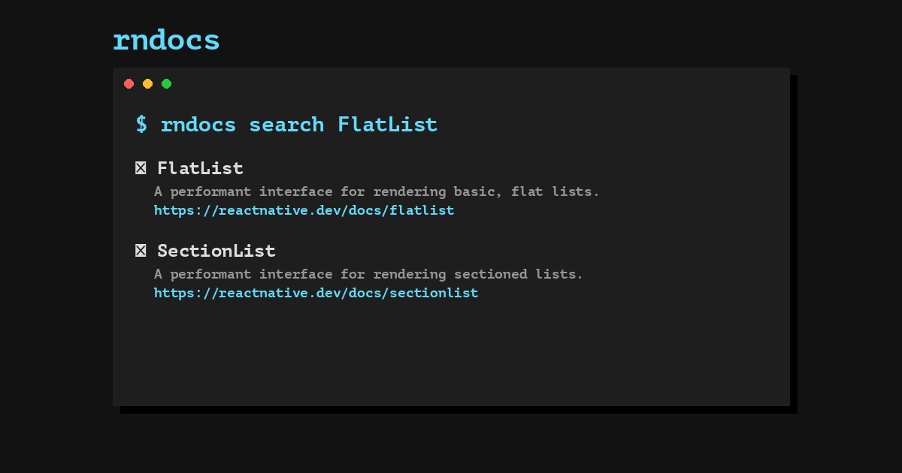

# rndocs



**rndocs** is a CLI tool that lets you search and read React Native documentation offline — no browser needed. It downloads the full React Native docs to your machine and gives you instant local search from the terminal.

## Key Features

- Search the entire React Native docs instantly from your terminal
- Read full documentation pages without opening a browser
- Works completely offline after the initial sync
- Integrates with Claude Code and other AI assistants as an MCP server

## Requirements

- Python 3.11 or later
- macOS, Linux, or Windows

## Installation

```bash
pip install rndocs
```

Then download the docs once:

```bash
rndocs sync
```

## Usage

**Search**
```bash
rndocs search "FlatList"
rndocs search "animation"
rndocs search "handle keyboard"
```

**Read a page**
```bash
rndocs get flatlist
rndocs get animated
rndocs get stylesheet
```

**Browse all pages**
```bash
rndocs ls
```

**Refresh docs**
```bash
rndocs sync
```

## Claude Code Integration

Add to your Claude Code MCP settings:

```json
{
  "mcpServers": {
    "rndocs": {
      "command": "rndocs-mcp"
    }
  }
}
```

Claude can now search and read React Native docs directly inside your conversations.

## Contributing

Contributions are welcome! If you've found a bug, have an idea for an improvement, or want to contribute new features, please open an issue or submit a pull request.

## Find this repository useful? :heart:
Support it by joining __[stargazers](https://github.com/androidpoet/rndocs/stargazers)__ for this repository. :star: <br>
Also, __[follow me](https://github.com/androidpoet)__ on GitHub for my next creations! 🤩
